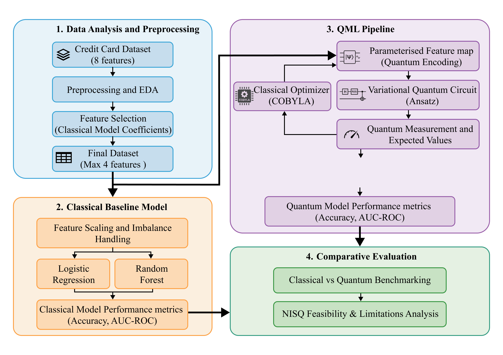
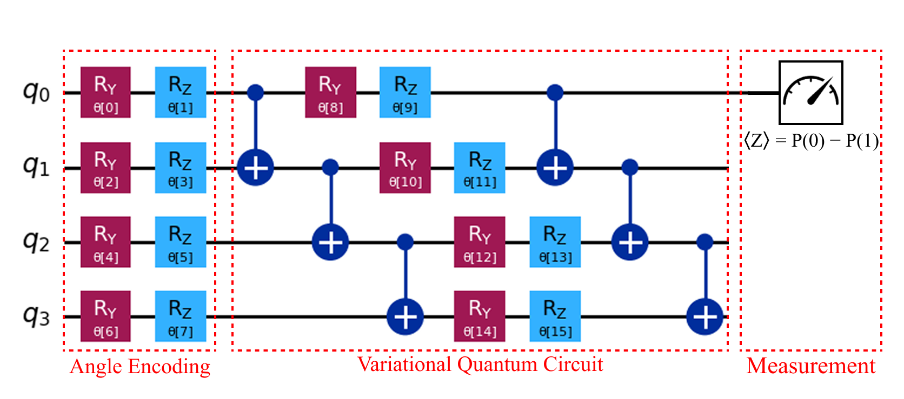

# ⚛️ Classical vs Quantum Machine Learning for Fraud Detection

## 📖 Project Overview
This project explores the application of **Quantum Machine Learning (QML)** to a real-world **credit card fraud detection** problem and benchmarks its performance against well-established **classical machine learning models**. The study focuses on understanding how **Variational Quantum Classifiers (VQC)** and **Quantum Neural Networks (QNN)** behave under realistic constraints of near-term quantum hardware.

Both ideal and noisy quantum simulations are considered to evaluate robustness, scalability, and practical feasibility.

---

## 🔄 Project Workflow

---

## 🗂 Dataset Description
The dataset contains **100,000 credit card transactions** with a binary target variable indicating fraudulent or legitimate activity.

**Feature Types:**
- Continuous features capturing transactional behavior  
  (e.g., distance-based and price-based ratios)
- Binary features representing usage patterns  
  (chip usage, PIN usage, online transactions, repeat retailers)

The dataset exhibits **strong class imbalance**, reflecting real-world fraud detection scenarios.

---

## 🔧 Data Processing & Feature Selection
- Exploratory data analysis to understand feature distributions and imbalance
- Log transformation applied to continuous variables to reduce skewness and stabilize variance
- Feature scaling to ensure compatibility with both classical and quantum models
- Model-based feature importance used to rank features
- Reduced feature sets (top 2, 3, and 4 features) created to match qubit limitations

---

## ⚙️ Modeling Approach

### Classical Models
- A Random Forest classifier was used as the classical baseline model
- The model captures complex non-linear relationships present in the dataset
- Training was performed on the full dataset to ensure a robust and fair comparison with quantum models

### Quantum Models
- **Variational Quantum Classifier (VQC)** implemented using:
  - Angle encoding for classical-to-quantum data mapping
  - Hardware-efficient variational circuits
  - COBYLA optimizer for hybrid quantum–classical training
- **Quantum Neural Network (QNN)** implemented as a deeper parameterized quantum circuit
- Experiments conducted with **2, 3, and 4 qubit configurations**
- Quantum models trained on reduced datasets due to simulation constraints

#### VQC Circuit Diagram 

---

## 📊 Evaluation Strategy
Models were evaluated using:
- Accuracy
- AUC-ROC

In addition to ideal simulations, **noise-aware simulations** were performed to analyze performance degradation under realistic quantum hardware conditions.

---

## 🔍 Key Observations
- Classical models consistently outperform quantum models in both accuracy and AUC-ROC
- VQC demonstrates more stable learning behavior compared to QNN
- Increasing qubit count improves expressivity only up to a point, after which performance degrades
- Quantum models are highly sensitive to noise, especially as circuit complexity increases
- Despite low accuracy, QML models sometimes preserve useful ranking information, reflected in AUC-ROC

---

## 🛠 Tools & Technologies
- Python  
- NumPy, Pandas  
- Scikit-learn  
- Qiskit & Qiskit Machine Learning  
- Matplotlib / Seaborn  

---

## 👩‍💻 Author
**Aditi B R**  
Email: aditibr1105@gmail.com
